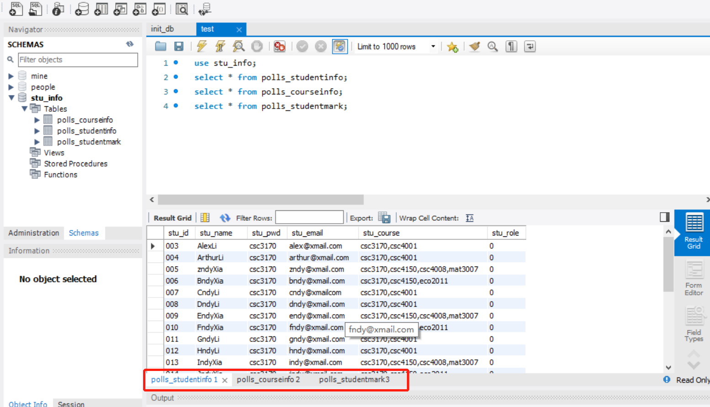
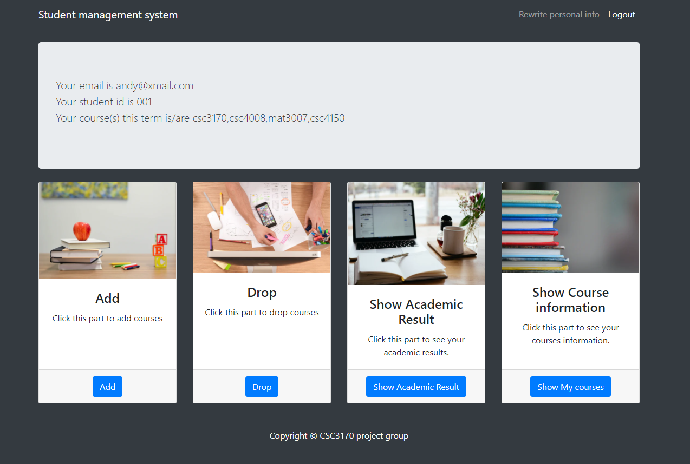
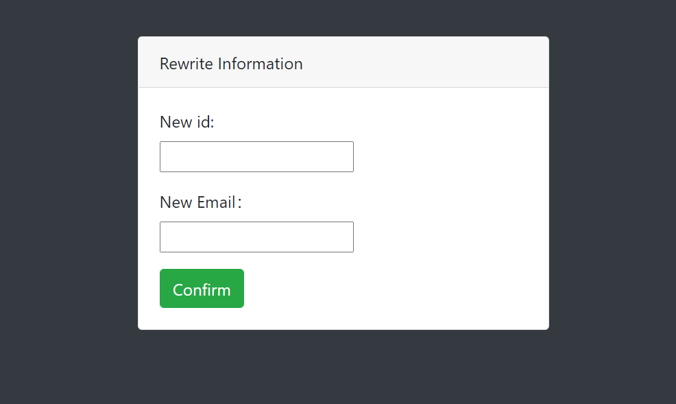

Database_project
====
A student manage system base on django and mysql.
This project is done by five students in CUHKSZ.
## Installation

Python and Django need to be installed

```bash
pip install django
pip install pymysql
```

## Initialize Database

1. Open your mysql work bench and run init_db.sql 
(you can run the test.sql to ensure the data has already been inserted)

2. Find the settings.py in mysite dictionary, change the mysql username and password into yours'


## Usage

Go to the database_project folder and run

```bash
python manage.py runserver
```

Then go to the browser and enter the url **http://127.0.0.1:8000/**


## Login

The login page is common for students and teachers.  
The username is their name and password for everyone is 'csc3170'.  

#### Example usernames:  
student
> * AndyXia
> * DodoXia
> * AlexLi
> * ArthurLi

teacher
> * AlanTuring

## Presentation
#### Home Page

#### Register Page

#### Alert for different kinds of errors


#### Student Page




#### Teacher Page


